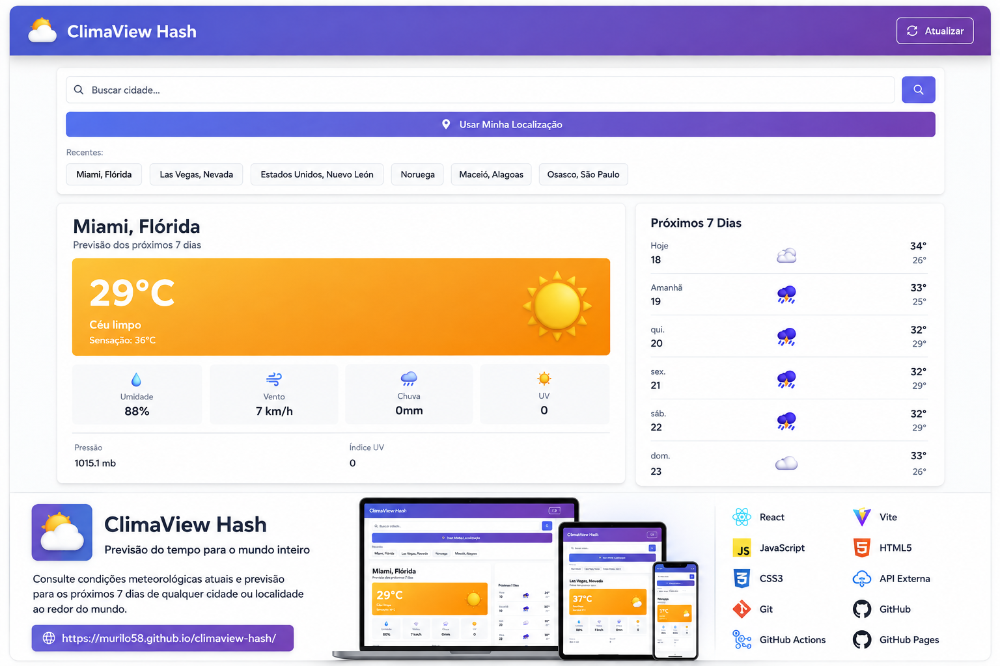

# 🌦️ ClimaView Hash

Aplicação web de previsão do tempo para localidades ao redor do mundo, desenvolvida com **React, Vite e integração com serviços meteorológicos externos**.

O ClimaView Hash permite consultar condições climáticas atuais e a previsão dos próximos 7 dias por meio de uma interface simples, responsiva e intuitiva.

O projeto foi desenvolvido como exercício prático de **desenvolvimento assistido por Inteligência Artificial com Claude Code**, abrangendo desde a definição de requisitos e arquitetura até versionamento, CI/CD e publicação da aplicação.

🌐 **Aplicação online:**  
https://murilo58.github.io/climaview-hash/



---

## 📸 Visão Geral

O ClimaView Hash oferece uma interface para consulta de informações meteorológicas de diferentes localidades.

O usuário pode pesquisar uma localidade manualmente ou utilizar sua localização atual para obter as condições climáticas.

A aplicação também mantém as localidades consultadas recentemente, facilitando novas consultas.

### Informações apresentadas

- 🌡️ Temperatura atual
- 🤒 Sensação térmica
- 💧 Umidade do ar
- 💨 Velocidade do vento
- 🌧️ Precipitação
- ☀️ Índice UV
- 🌡️ Pressão atmosférica
- 📅 Previsão para os próximos 7 dias

---

## ✨ Funcionalidades

### 🔎 Busca de localidades

Permite pesquisar cidades e localidades em diferentes países e consultar suas condições meteorológicas.

### 📍 Geolocalização

O usuário pode utilizar a localização fornecida pelo navegador para consultar automaticamente as condições meteorológicas da região onde se encontra.

### 🕒 Localidades recentes

As localidades consultadas recentemente ficam disponíveis na interface para facilitar novas consultas.

### 🌡️ Condições atuais

A aplicação apresenta os principais indicadores meteorológicos da localidade selecionada.

### 📅 Previsão de 7 dias

Além das condições atuais, são apresentadas temperaturas e condições previstas para os próximos dias.

### 🔄 Atualização

Os dados meteorológicos podem ser atualizados diretamente pela interface.

### 📱 Interface responsiva

A interface foi projetada para adaptação a diferentes tamanhos de tela.

---

## 🌍 Evolução do Escopo

O escopo inicial do ClimaView Hash previa consultas meteorológicas para localidades brasileiras.

Durante o desenvolvimento, foi identificada a possibilidade de ampliar a cobertura da aplicação sem aumentar significativamente a complexidade da solução.

A aplicação foi então evoluída para permitir consultas de localidades ao redor do mundo, mantendo a mesma experiência para busca, previsão meteorológica e histórico de localidades recentes.

Essa expansão representa uma **decisão de produto realizada durante o desenvolvimento**, evoluindo o escopo inicialmente definido no PRD.

---

## 🛠️ Tecnologias

O projeto utiliza tecnologias e recursos como:

- **React**
- **JavaScript**
- **Vite**
- **HTML5**
- **CSS3**
- **API meteorológica externa**
- **Geolocation API**
- **LocalStorage**
- **Node.js**
- **npm**
- **Git**
- **GitHub**
- **GitHub Actions**
- **GitHub Pages**

---

## 🏗️ Arquitetura

O ClimaView Hash utiliza uma arquitetura frontend sem backend próprio.

A aplicação executada no navegador é responsável pela interação com o usuário, obtenção da localização e comunicação com os serviços externos utilizados para obtenção dos dados.

### Fluxo simplificado

```text
┌─────────────────────┐
│       Usuário       │
└──────────┬──────────┘
           │
           ▼
┌─────────────────────┐
│   Interface React   │
└──────────┬──────────┘
           │
           ├──────────────► Geolocation API
           │
           ▼
┌─────────────────────┐
│ Serviços externos   │
│ de dados climáticos │
└──────────┬──────────┘
           │
           ▼
┌─────────────────────┐
│ Processamento dos   │
│       dados         │
└──────────┬──────────┘
           │
           ▼
┌─────────────────────┐
│ Atualização da UI   │
└─────────────────────┘
```

As informações necessárias para melhorar a experiência de navegação, como localidades recentemente consultadas, podem ser mantidas localmente no navegador.

---

## 📂 Estrutura do Projeto

```text
climaview-hash/
│
├── .claude/
│
├── .github/
│   └── workflows/
│       └── deploy.yml
│
├── src/
│
├── .env.example
├── .gitignore
├── index.html
├── package.json
├── package-lock.json
├── vite.config.js
│
├── PRD.md
├── ARCHITECTURE.md
└── README.md
```

> `node_modules` é utilizado no ambiente local, mas não deve ser versionado no repositório.

---

## 📋 Documentação do Projeto

Além do código-fonte, o projeto possui documentação para registrar requisitos e decisões de arquitetura.

### `PRD.md`

Product Requirements Document utilizado para definir:

- visão do produto;
- escopo inicial;
- funcionalidades;
- requisitos técnicos;
- comportamentos de UX;
- tratamento de exceções;
- critérios de sucesso.

### `ARCHITECTURE.md`

Documento destinado ao registro da arquitetura da solução e das principais decisões técnicas adotadas durante o desenvolvimento.

---

## 🤖 Desenvolvimento Assistido por IA

O ClimaView Hash também foi desenvolvido como experiência prática de **AI-Assisted Software Development**.

O **Claude Code** foi utilizado como ferramenta de apoio ao ciclo de desenvolvimento, auxiliando em atividades como:

- definição e refinamento de requisitos;
- estruturação da aplicação;
- apoio à implementação;
- organização do código;
- documentação;
- análise e resolução de problemas;
- preparação do projeto para publicação.

A Inteligência Artificial foi incorporada ao processo como ferramenta de apoio ao desenvolvimento, enquanto o projeto permaneceu estruturado em práticas tradicionais de engenharia de software, documentação e controle de versão.

---

## 🔄 Fluxo de Desenvolvimento

O projeto seguiu um fluxo envolvendo:

```text
Definição da ideia
        ↓
Product Requirements Document
        ↓
Definição da arquitetura
        ↓
Desenvolvimento assistido por IA
        ↓
Testes locais
        ↓
Versionamento com Git
        ↓
Repositório GitHub
        ↓
GitHub Actions
        ↓
Build automatizado
        ↓
Deploy no GitHub Pages
```

Esse processo permitiu experimentar um ciclo de desenvolvimento envolvendo **produto, engenharia de software, IA, versionamento e automação de entrega**.

---

## 🚀 Executando Localmente

### Pré-requisitos

É necessário possuir **Node.js** e **npm** instalados.

### 1. Clone o repositório

```bash
git clone https://github.com/Murilo58/climaview-hash.git
```

### 2. Entre no diretório

```bash
cd climaview-hash
```

### 3. Instale as dependências

```bash
npm install
```

### 4. Execute o ambiente de desenvolvimento

```bash
npm run dev
```

O Vite iniciará o servidor de desenvolvimento local.

---

## 📦 Build de Produção

Para gerar a versão otimizada da aplicação:

```bash
npm run build
```

Os arquivos de produção serão gerados no diretório:

```text
dist/
```

---

## 🚀 CI/CD e Deploy

O projeto utiliza **GitHub Actions** para automatizar o processo de build e publicação.

Quando uma alteração é enviada para a branch `main`, o workflow de deploy executa automaticamente o pipeline.

### Pipeline

```text
Push para main
      ↓
GitHub Actions
      ↓
Checkout
      ↓
Configuração do Node.js
      ↓
Instalação das dependências
      ↓
Build com Vite
      ↓
Geração do artefato
      ↓
GitHub Pages
      ↓
Aplicação publicada
```

Dessa forma, novas versões podem ser publicadas a partir do próprio fluxo de versionamento do projeto.

---

## 🌐 Ambiente Publicado

A aplicação está disponível publicamente através do GitHub Pages:

**ClimaView Hash**

https://murilo58.github.io/climaview-hash/

---

## 🎯 Objetivo do Projeto

O ClimaView Hash foi criado como projeto prático para explorar a integração entre diferentes disciplinas e tecnologias:

**Produto + Engenharia de Software + Desenvolvimento Frontend + APIs + Geolocalização + Git/GitHub + CI/CD + Inteligência Artificial**

Além da aplicação meteorológica, o projeto demonstra um fluxo completo envolvendo:

- levantamento e documentação de requisitos;
- definição de arquitetura;
- desenvolvimento;
- integração com serviços externos;
- controle de versão;
- automação de build;
- CI/CD;
- publicação de uma aplicação web;
- utilização de IA generativa no processo de desenvolvimento.

---

## 🔮 Possíveis Evoluções

O projeto pode continuar evoluindo com funcionalidades previstas ou derivadas da visão inicial do produto, como:

- alertas de eventos climáticos severos;
- previsão estendida;
- gráficos de evolução meteorológica;
- visualizações geográficas;
- radar de precipitação;
- histórico climático;
- novas opções de atualização automática;
- melhorias de acessibilidade;
- evolução da experiência mobile.

---

## 👤 Autor

**Murilo Costa**

Especialista em Projetos de TI | PMP®  
Projetos • Tecnologia • Transformação Digital • Inteligência Artificial

GitHub:  
https://github.com/Murilo58
